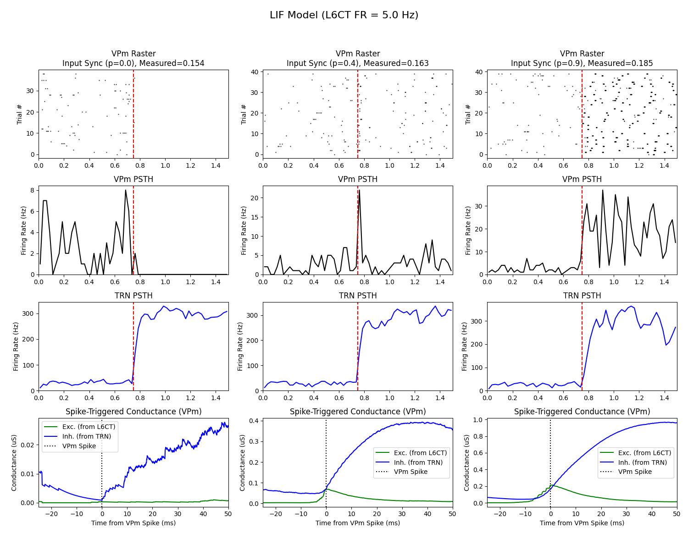

# Modeling the Role of Excitatory and Inhibitory Conductances in L6CT Synchrony and its Effect on LFP Oscillations

A conductance-based Leaky Integrate-and-Fire (LIF) model of the thalamocortical circuit (L6CT → TRN → VPm) that demonstrates how input synchrony, independent of firing rate, gates thalamic sensory throughput via a "window of opportunity" between excitation and delayed inhibition. The model replicates findings from Dimwamwa et al. (2024) and extends them to simulate synchrony-driven cortical LFP oscillations.

**Authors:** Minjae Chung, John Davis, Brady Souma
**Course:** BMED 7610 — Quantitative Neuroscience, Georgia Institute of Technology
**Advisor:** Dr. Garrett Stanley
**Date:** December 2025

---

## Circuit Architecture

The model simulates a three-node thalamocortical circuit:

```
L6CT (35 synthetic neurons)
   │
   ├──► TRN (inhibitory) ──► VPm (feedforward inhibition)
   │                              ▲
   └──────────────────────────────┘ (direct excitation)
```

- **L6CT → TRN**: Excitatory input drives the inhibitory TRN
- **L6CT → VPm**: Excitatory input directly excites VPm
- **TRN → VPm**: Feedforward inhibition arrives with a synaptic delay

The "window of opportunity" emerges because synchronous L6CT spikes create a sharp excitatory conductance peak in VPm *before* the delayed TRN inhibition can suppress it. Asynchronous inputs instead recruit sustained inhibition, suppressing VPm firing.

## Key Results

**Synchrony controls thalamic gating, not firing rate.** Sweeping the synchrony parameter (`sharedProb`) from 0.0 to 0.9 while holding L6CT firing rate constant at 17.6 Hz:

- **p = 0.0** (asynchronous): VPm is suppressed below baseline — TRN inhibition dominates
- **p = 0.9** (synchronous): VPm fires robustly — excitation outpaces inhibition via the temporal window

| Output | Description |
|--------|------------|
| VPm Raster | Transition from sparse random spiking to dense reliable spiking |
| VPm PSTH | Firing rate increases with synchrony despite constant input rate |
| TRN PSTH | TRN saturates (~200 Hz) regardless of synchrony level |
| Spike-Triggered Conductance | Sharp excitatory peak precedes inhibitory peak at high synchrony |

<p align="center">
  
</p>

## Algorithmic Spike Generation

Synchrony is decoupled from firing rate using a shared/independent source mixing algorithm:

1. **Shared source**: A single Poisson spike train (rate `R`) common to all 35 neurons
2. **Independent sources**: Unique Poisson trains for each neuron (rate `R`)
3. **Mixing**: For each neuron, spikes are drawn from the shared source with probability `sharedProb` and from the independent source with probability `1 - sharedProb`
4. **Result**: Total spike count is statistically constant across synchrony levels; only temporal alignment changes

Synchrony is validated using pairwise cross-correlogram (CCG) analysis with a +/-7.5 ms window, following the metric from Dimwamwa et al.

## LIF Model Equations

Each neuron (TRN, VPm) is governed by the conductance-based LIF equation:

```
C_i * dV_i/dt = G_L,i * (E_L,i - V_i)           # leak
              + g_i^CT * (E_exc - V_i)            # L6CT excitation
              + g_i^noise * (E_exc - V_i)          # background noise
              + g_i^TRN→VPm * (E_inh - V_i)       # TRN inhibition (VPm only)
```

Integrated via Euler's method at dt = 0.1 ms. Spike threshold at -54 mV, reset at -80 mV, 1 ms refractory period. Synaptic conductances decay exponentially (tau = 10 ms) with 1 ms latency.

## Project Structure

```
.
├── run_simulation.py          # Main entry point — runs the full experiment
├── src/
│   ├── config.py              # All biophysical and simulation parameters
│   ├── spike_generation.py    # Poisson process and L6CT synchrony algorithm
│   ├── lif_model.py           # 2-neuron (TRN, VPm) LIF simulation loop
│   ├── analysis.py            # Synchrony (CCG), STA, and PSTH computation
│   └── plotting.py            # Raster, trace, and synchrony visualization
├── Dimwamwa_python.py         # Original monolithic script (historical reference)
├── notebooks/                 # Exploratory analysis
│   └── .gitkeep
├── tests/                     # Algorithm verification
│   └── __init__.py
├── plots_generated_from_Dimwamwa_python/   # Generated figures
└── Modeling_the_Role_of_Excitatory_and_Inhibitory_Conductances_in_L6CT_Synchrony_and_its_Effect_on_LFP_Oscillations.pdf
```

## Usage

### Requirements

- Python 3.8+
- NumPy
- SciPy
- Matplotlib
- tqdm

### Running the simulation

```bash
python run_simulation.py
```

This sweeps over synchrony levels [0.0, 0.3, 0.6, 0.9] with 40 trials each and generates:
- L6CT input raster plots per synchrony level
- VPm membrane potential and conductance traces
- Summary figure with VPm/TRN rasters, PSTHs, and spike-triggered conductances
- Synchrony validation plot (sharedProb vs. measured CCG synchrony)

All plots are saved to `plots_generated_from_Dimwamwa_python/` with timestamps.

### Key parameters (in `src/config.py`)

| Parameter | Value | Description |
|-----------|-------|-------------|
| `numCTNeurons` | 35 | L6CT population size |
| `tStep` | 0.1 ms | Simulation time step |
| `endTime` | 2.0 s | Total simulation duration |
| `ctStartTime` | 1.0 s | L6CT stimulation onset |
| `nTrials` | 40 | Trials per synchrony condition |
| `Vth` | -54 mV | Spike threshold |
| `tauS` | 10 ms | Synaptic conductance decay |
| `PSweight[1,0]` | 0.06 | TRN → VPm inhibitory weight |

## References

1. Dimwamwa, E. D., Pala, A., Chundru, V., Wright, N. C., & Stanley, G. B. (2024). Dynamic corticothalamic modulation of the somatosensory thalamocortical circuit during wakefulness. *Nature Communications*, 15, 3529.

2. Russo, S., Dimwamwa, E. D., & Stanley, G. B. (2025). Layer 6 corticothalamic neurons induce high gamma oscillations through cortico-cortical and cortico-thalamo-cortical pathways. *bioRxiv*.
